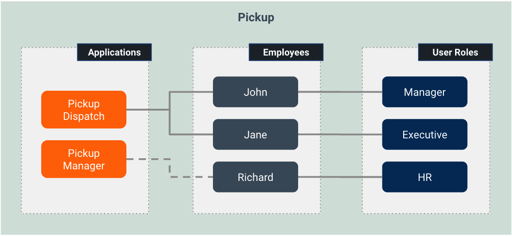
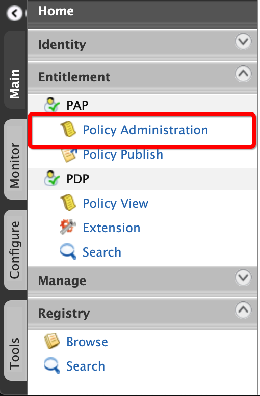
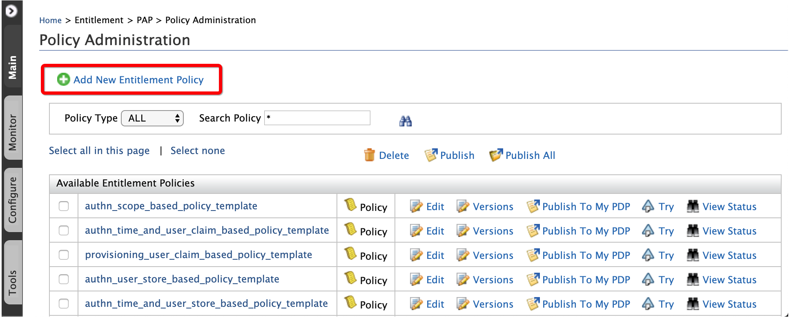
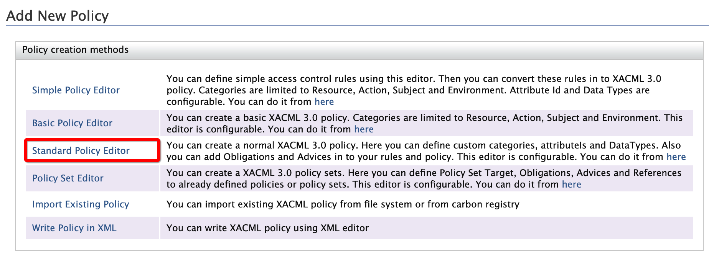
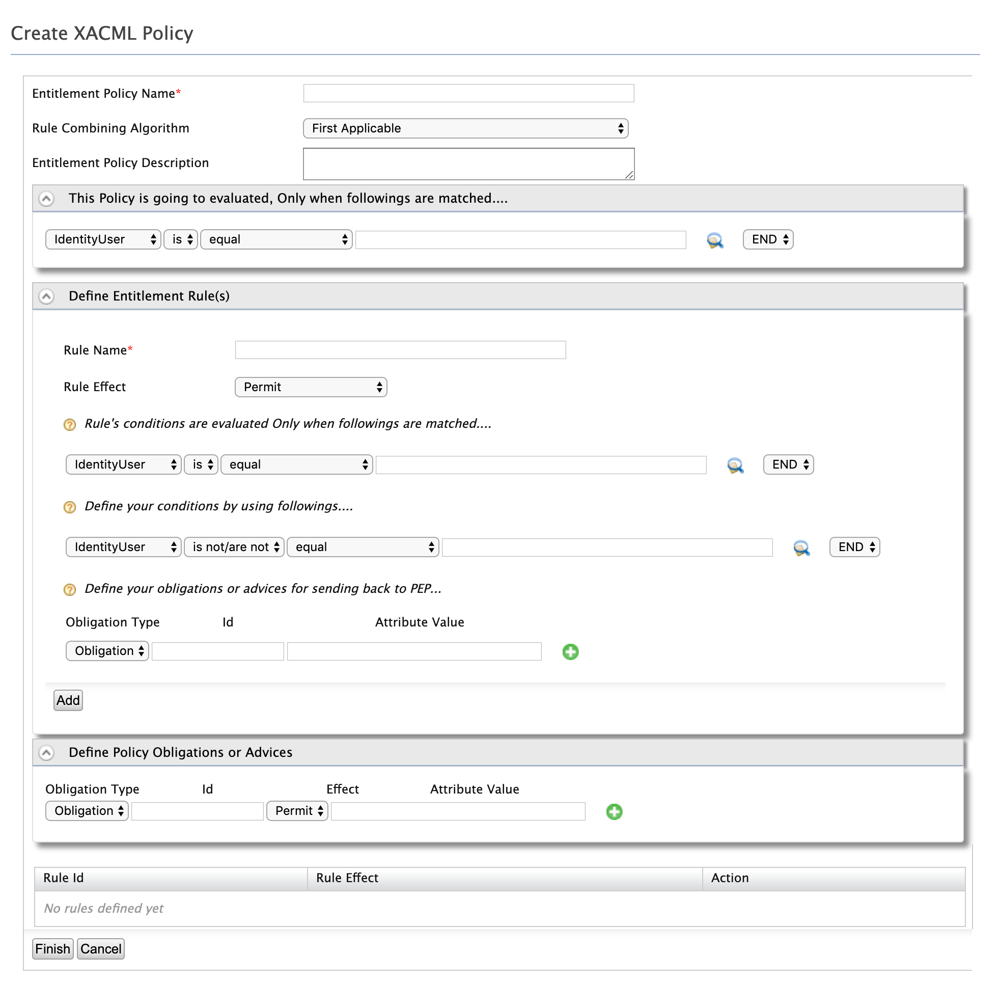
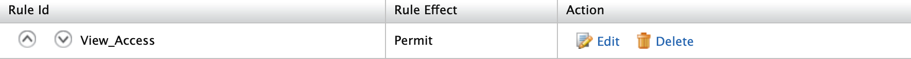
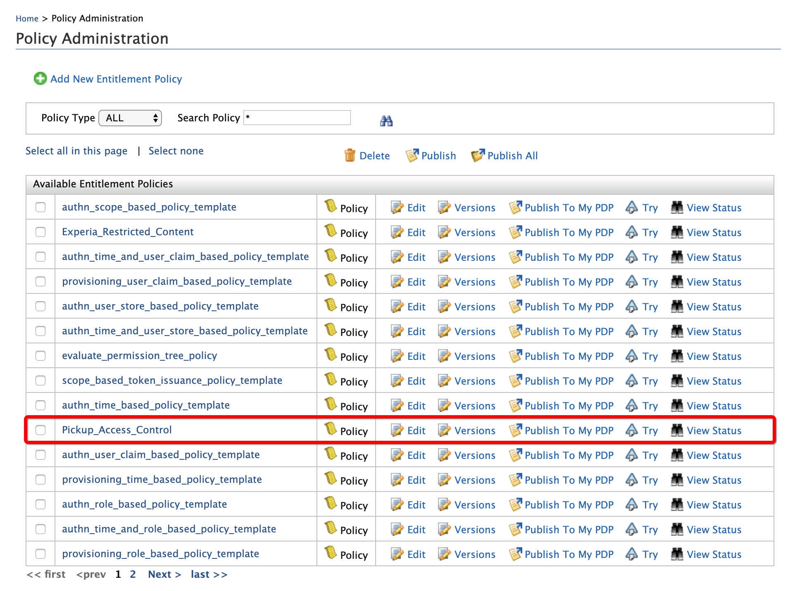

# Fine-grained Authorization for Applications

WSO2 Identity Server supports fine-grained access control at the application level using XACML policies. When authorization is enabled on an application, IS evaluates a XACML policy after authentication to decide whether the authenticated user is permitted to access the application.

This is handled by the **XACML Authorization Handler**, which acts as a Policy Enforcement Point (PEP) within the authentication flow.

> **Prerequisite**: The XACML connector must be installed. See the [setup guide](../../README.md).

> **Note on screenshots**: Screenshots in this guide are from IS 5.11. With the connector on IS 7.x, Policy Administration is accessed via `https://localhost:9443/console`. The UI layout may differ slightly but the functionality is equivalent.

---

## How it works

When a user authenticates to an application with **Enable authorization** turned on, the XACML Authorization Handler intercepts the post-authentication step and sends a XACML request to the PDP. The request includes:

- The service provider (application) name
- The authenticated user's username, user store domain, and tenant
- Any additional attributes from the authentication context (e.g., roles, claims)

The PDP evaluates any published policies against this request and returns **Permit** or **Deny**. If Deny, the user is blocked from accessing the application.

---

## Scenario

**Pickup** is a cab company with two applications:
- **Pickup Manager**: HR management portal
- **Pickup Dispatch**: Vehicle and driver allocation system

Three employees:
- **Larry**: Manager; can view allocations in Pickup Dispatch (GET)
- **Sam**: Executive; can view and create allocations in Pickup Dispatch (GET + POST)
- **Kim**: HR manager; only has access to Pickup Manager, not Pickup Dispatch

The goal is to create a XACML policy that enforces these access rules on Pickup Dispatch.

---

## Step 1: Enable authorization on the application

1. Log in to the IS Console.
2. Navigate to **Applications** and select **Pickup Dispatch**.
3. Go to the **Advanced** tab.
4. Enable the **Enable authorization** checkbox and click **Update**.

---

## Step 2: Create the XACML policy

1. Navigate to **Policy Administration** in the IS Console.

   

2. Click **New Policy**. The policy creation options appear:

   

3. Click **Standard Policy Editor**.

   

4. Fill in the policy details:

   

   - **Entitlement Policy Name**: `Pickup_Access_Control`
   - **Policy evaluation criteria**: Target the Pickup Dispatch resources:

     | Category | Function | Value |
     |---|---|---|
     | Resource | equals-with-regex-match | `/pickup-dispatch/.+` |

5. Define the rules:

   **Rule 1: Grant GET access to Larry and Sam**

   - Rule Name: `View_Access`
   - Rule Effect: `Permit`
   - Conditions:
     - Subject `at-least-one-member-of` → `Larry,Sam`
     - AND Action `equal` → `GET`

   Click **Add**.

   

   **Rule 2: Grant POST access to Sam**

   - Rule Name: `Edit_Access`
   - Rule Effect: `Permit`
   - Conditions:
     - Subject `equal` → `Sam`
     - AND Action `equal` → `POST`

   Click **Add**.

   **Rule 3: Deny POST access for Larry**

   - Rule Name: `Deny_Edit_Access`
   - Rule Effect: `Deny`
   - Conditions:
     - Subject `equal` → `Larry`
     - AND Action `equal` → `POST`

   Click **Add**.

   **Rule 4: Deny all access for Kim**

   - Rule Name: `Deny_Kim`
   - Rule Effect: `Deny`
   - Conditions:
     - Subject `equal` → `Kim`

   Click **Add**.

6. Click **Finish** to save the policy.

7. Locate **Pickup_Access_Control** in the policy list and click **Activate** to enable it for runtime evaluation.

   

---

## Step 3: Try it out

Use the **TryIt** tool to verify the policy without triggering real authentication flows:

1. Click **Try** next to the policy.
2. Test the following cases:

   | Subject | Action | Resource | Expected |
   |---|---|---|---|
   | Larry | GET | `/pickup-dispatch/protected/index.jsp` | Permit |
   | Larry | POST | `/pickup-dispatch/protected/index.jsp` | Deny |
   | Sam | GET | `/pickup-dispatch/protected/index.jsp` | Permit |
   | Sam | POST | `/pickup-dispatch/protected/index.jsp` | Permit |
   | Kim | GET | `/pickup-dispatch/protected/index.jsp` | Deny |

---

## Using authentication policy templates

For common patterns, the connector ships pre-built policy templates in [`resources/policies/`](../policies/). The `authn_*` templates are designed for the authentication flow:

| Template | Use case |
|---|---|
| `authn_role_based_policy_template` | Permit users with specific roles; deny all others |
| `authn_scope_based_policy_template` | Permit users authenticated with specific OAuth scopes |
| `authn_time_based_policy_template` | Permit access only within a defined time window |
| `authn_time_and_role_based_policy_template` | Combination: role + time window |
| `authn_time_and_scope_based_policy_template` | Combination: scope + time window |
| `authn_time_and_user_claim_based_policy_template` | Combination: user claim values + time window |
| `authn_time_and_user_store_based_policy_template` | Combination: user store + time window |
| `authn_user_claim_based_policy_template` | Permit users with specific claim values |
| `authn_user_store_based_policy_template` | Permit users from specific user stores |
| `authn_group_based_policy_template` | Permit users in specific groups |

To use a template:

1. Copy the XML content from the template file in `resources/policies/`.
2. In **Policy Administration**, click **New Policy > Write Policy in XML**, paste the content.
3. Replace placeholder values (`SP_NAME`, `ROLE_1`, `ROLE_2`, etc.) with your actual values.
4. Click **Create**, then click **Activate** to enable the policy for runtime evaluation.

See [XACML Policy Templates](xacml-policy-templates.md) for a full reference of all placeholders and examples.
