# Managing XACML Policies

This guide covers the full lifecycle of XACML policies in WSO2 Identity Server: creating, editing, publishing, enabling/disabling, viewing status, managing versions, and testing with the TryIt tool.

> **Prerequisite**: The XACML connector must be installed and the Console's Policy Administration UI enabled. See the [setup guide](../../README.md).

> **Note on screenshots**: The screenshots in this guide are taken from IS 5.11. With the XACML connector installed on IS 7.x, Policy Administration is accessible via `https://localhost:9443/console`. The UI layout may differ slightly from the screenshots, but all functionality described is equivalent.

---

## Policy lifecycle

A XACML policy follows a defined lifecycle inside the Policy Administration Point (PAP):

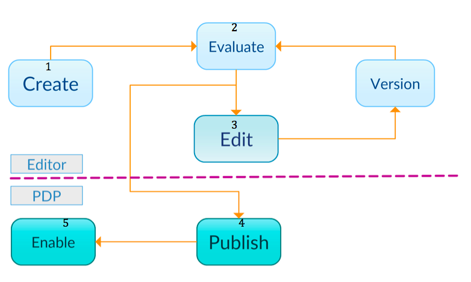

1. **Create** — Write a policy using one of the six editors (Simple, Basic, Standard, Policy Set, Import, or XML).
2. **Test** — Evaluate the policy against sample requests using the TryIt tool *before* publishing — without affecting the live PDP.
3. **Revise** — Edit and retest. IS automatically versions the policy on each save so you can revert to any previous version.
4. **Publish** — When the policy is correct, publish it to the PDP. It becomes active for runtime evaluation.
5. **Enable/Disable** — Toggle enforcement in the PDP without deleting the policy.

---

## Create a policy

Navigate to the IS Console, go to **Policy Administration**, and click **New Policy**.

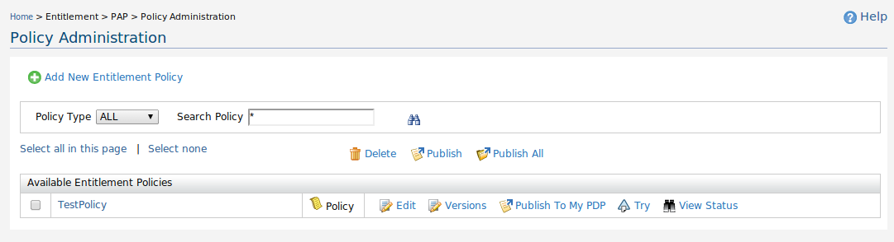

The **Add New Policy** screen offers six creation methods:

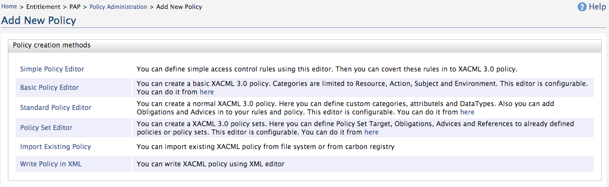

### Simple Policy Editor

A UI-driven editor that requires no knowledge of XACML syntax. Policies are built around four categories: **Subject** (who), **Resource** (what), **Action** (how), and **Environment** (when/where).

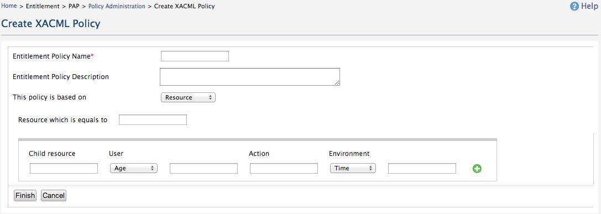

Key behaviours:
- A **Deny rule is automatically added** as the final rule — everything not explicitly permitted is denied.
- Permitted rules are evaluated **top to bottom**.
- Supports regex with `{ }`, OR/AND with `|` / `&`, range with `[ ]` / `( )`, and comparison with `<` / `>`.

Example — policy allowing admin role to read/write `foo`, and wso2.com email users to read `foo/wso2` between 09:00–16:00:

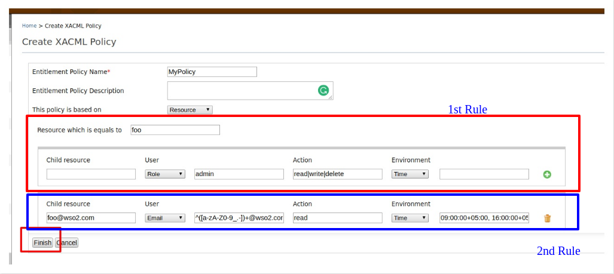

Child resources can be added with the  icon.

> **Note**: The Simple Policy Editor targets XACML 2.0. Policies created here appear in design view (not XML view) when edited.

### Basic Policy Editor

Designed for XACML 3.0 rules. Supports defining a target (when the policy applies) and multiple ordered rules with effects (Permit/Deny).

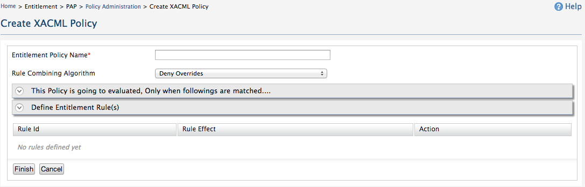

You can plug in attribute value sources (user store roles, registry resources, custom sources) rather than typing values manually.

**Sample scenario** — patient records at `/patient/` accessible only 09:00–16:00, createable/deletable by MedAdministrator, updatable/readable by MediStaff:

| Step | What to configure |
|---|---|
| 1 | Define the policy name |
| 2 | Set target: resource matches `/patient//*` (regex) |
| 3 | Rule 1 — Deny for access outside 09:00–16:00 (time `is not` in range) |
| 4 | Rule 2 — Permit for MedAdministrator role with create/delete actions |
| 5 | Rule 3 — Permit for MediStaff role with read/update actions |
| 6 | Rule 4 — Deny all others |
| 7 | Set rule-combining algorithm (e.g., `first-applicable`) and click **Finish** |

### Standard Policy Editor

Similar to the Basic Editor but adds **XACML 3.0 Obligations and Advice** at the rule level.

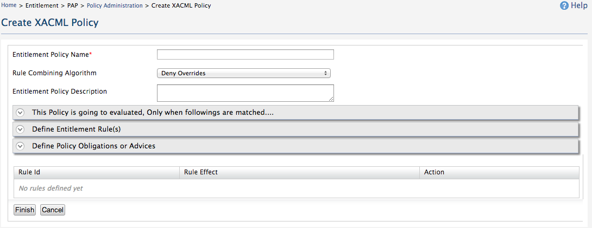

- **Obligations** — statements the PEP *must* fulfil (e.g., log the access).
- **Advice** — statements the PEP *may* consider (e.g., explain a denial to the user).

Define obligations/advice using the **Define Policy Obligation or Advice** field at the bottom of the editor.

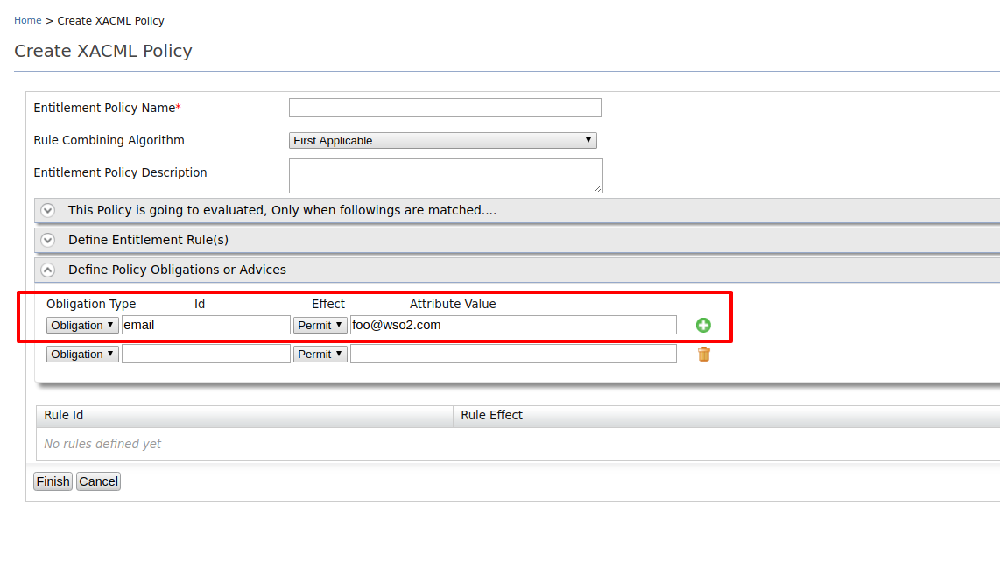

### Policy Set Editor

Groups multiple policies that are evaluated together. Click **Add Policy** to include existing policies, set a policy-combining algorithm, and click **Finish**.

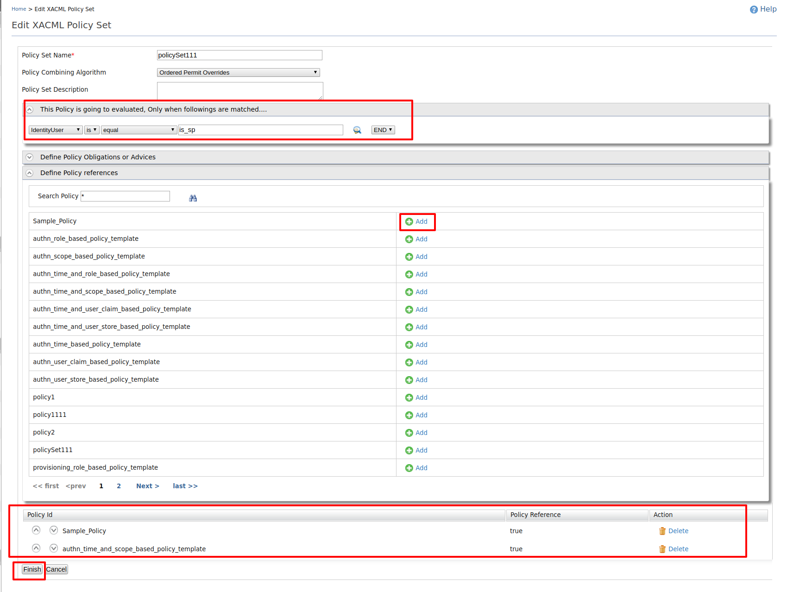

### Import Existing Policy

Upload a XACML policy XML file from your local machine.

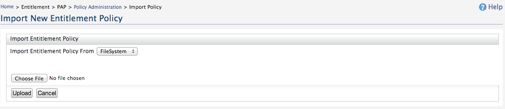

### Write Policy in XML

Paste raw XACML 3.0 XML directly into the editor.

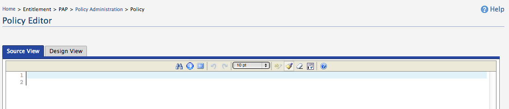

Policy combining algorithms reference

| Algorithm | Behaviour |
|---|---|
| `deny-overrides` | Any Deny wins. Safest choice when Deny should take priority. |
| `permit-overrides` | Any Permit wins. Useful when at least one match should grant access. |
| `first-applicable` | First rule that evaluates to Permit or Deny wins. Short-circuits evaluation. |
| `deny-unless-permit` | Returns Deny if no Permit; hides NotApplicable/Indeterminate. |
| `permit-unless-deny` | Returns Permit if no Deny; hides NotApplicable/Indeterminate. |
| `only-one-applicable` | For PolicySets — exactly one child must produce a valid decision. |
| `ordered-deny-overrides` | Same as `deny-overrides` but evaluation order is guaranteed. |
| `ordered-permit-overrides` | Same as `permit-overrides` but evaluation order is guaranteed. |

---

## Edit a policy

1. Go to **Policy Administration**.
2. Find the policy and click **Edit**.

   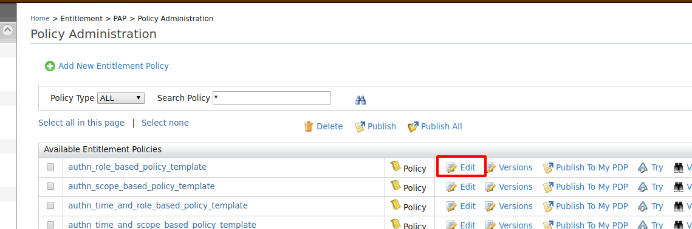

3. Edit the XML and click **Save Policy**.

   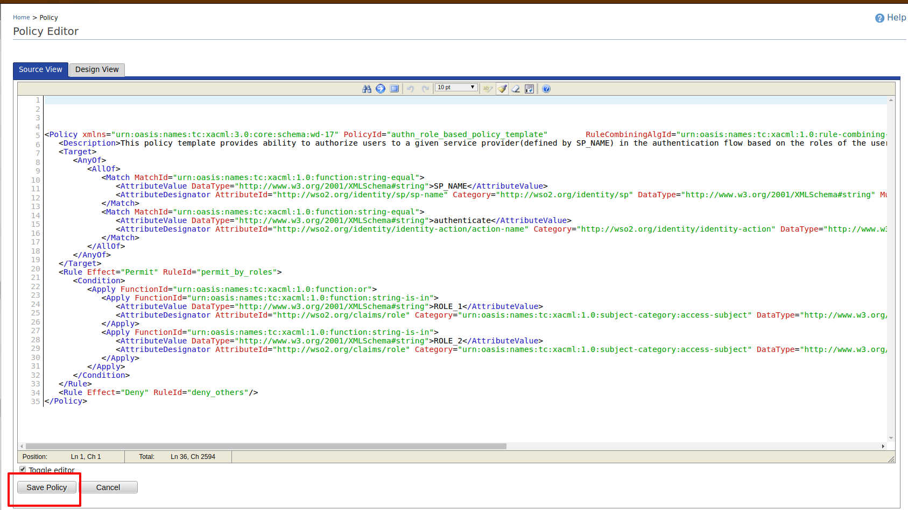

> Policies created with the Simple Policy Editor open in design view, not XML view, when edited. The base condition cannot be changed after creation.

After editing, publish the updated policy to the PDP — click **Publish To My PDP** next to the policy in the list.

---

## Publish a policy to the PDP

A policy is not enforced until it is published to the **Policy Decision Point (PDP)**. Publishing syncs the PAP policy store to the PDP.

1. In **Policy Administration**, find the policy in the **Available Entitlement Policies** table.

   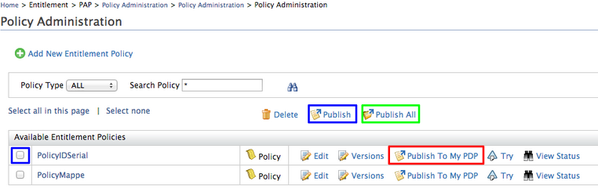

2. Click **Publish to My PDP** next to the policy (or select multiple and click **Publish**, or click **Publish All**).

3. The **Publish Policy** screen appears:

   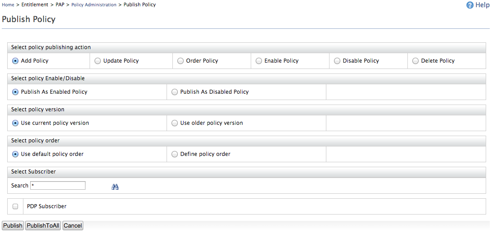

4. Configure the publish action:

   | Publishing action | When to use |
   |---|---|
   | **Add Policy** | First-time publish of a new policy to PDP |
   | **Update Policy** | Re-publish after editing an already-published policy |
   | **Order Policy** | Re-order existing published policies |
   | **Enable Policy** | Re-enable a disabled policy in PDP |
   | **Disable Policy** | Disable without deleting |
   | **Delete Policy** | Remove a policy from PDP |

5. Choose whether to publish as **Enabled** or **Disabled**, and optionally set a priority order.

6. Click **Publish**.

After publishing, the policy appears in **PDP > Policy View**. When you have multiple policies published, select a **global policy combining algorithm** and click **Update**.

Policy order (priority) can be changed using the **Edit Order** link — policies are evaluated in ascending order (lower number = evaluated first).

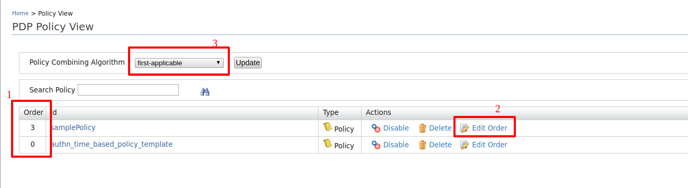

---

## Enable or disable a policy

To enable or disable a policy already published to the PDP:

1. Navigate to **PDP > Policy View**.
2. Locate the policy and click **Enable** or **Disable**.

   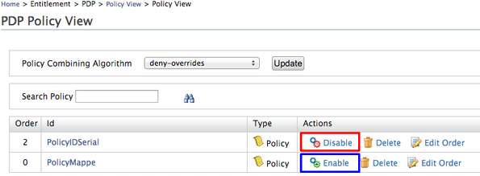

To enable/disable before publishing, use the **Enable Policy** / **Disable Policy** action in the [Publish Policy](#publish-a-policy-to-the-pdp) screen.

---

## View policy status

Policy status tracks every action performed on a policy (create, edit, publish, enable, delete).

1. Go to **Policy Administration**.
2. Click **View Status** next to the policy.

   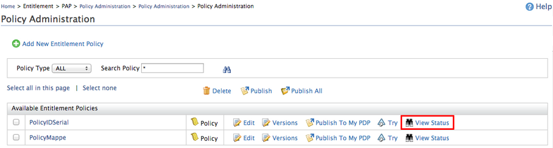

3. The status history shows:

   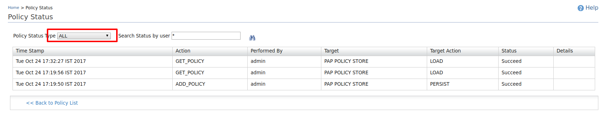

   | Column | Description |
   |---|---|
   | Time Stamp | When the action occurred |
   | Action | What was performed |
   | Performed By | User or tenant who acted |
   | Target | Policy location |
   | Target Action | The operation on the policy |
   | Status | Success or failure |
   | Details | Additional context |

4. Use the **Policy Status Type** filter to narrow results:

   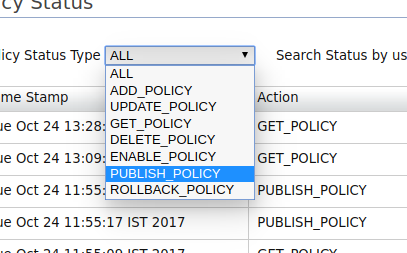

   Available types: `ADD_POLICY`, `UPDATE_POLICY`, `GET_POLICY`, `DELETE_POLICY`, `ENABLE_POLICY`, `PUBLISH_POLICY`.

---

## Manage policy versions

Every change to a policy creates a new version. You can view and restore previous versions.

1. Go to **Policy Administration**.
2. Click **Versions** next to the policy.

   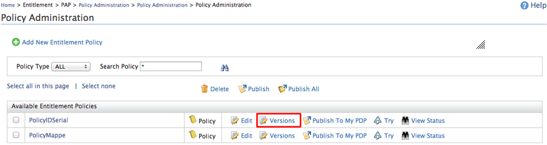

3. The version screen shows:

   | Field | Description |
   |---|---|
   | Entitlement Policy Id | The policy name |
   | Entitlement Policy Version | Use the dropdown to switch between versions |
   | Version Created Time | Timestamp of the selected version |
   | Version Created User | Who created the version |

Select an older version from the dropdown to view its content and restore it if needed.

---

## Test a policy with the TryIt tool

The **TryIt tool** lets you evaluate a policy directly from the PAP against sample requests — without publishing to the PDP and without triggering real application flows. Use it to verify policy logic before activating.

1. Go to **Policy Administration**, find the policy, and click **Try**.
2. The TryIt screen appears. Fill in:
   - **Resource** — The resource being accessed (e.g., `/pickup-dispatch/protected/index.jsp`)
   - **Subject Name** — The user making the request
   - **Action Name** — The operation (e.g., `GET`, `POST`)
3. Click **Test Evaluate**.

The result is **Permit** or **Deny** based on the policy as written in the PAP.

You can also write custom XACML 3.0 XML requests manually using the **Create Request Using Editor** button for more complex scenarios (multiple subjects, custom categories, etc.).

---

## Delete a policy

To delete a policy that has been published to the PDP, first remove it from the PDP:

1. Go to **PDP > Policy View**.
2. Click **Delete** next to the policy and confirm.

Then delete from the PAP:

1. Go to **Policy Administration**.
2. Click **Delete** next to the policy and confirm.
