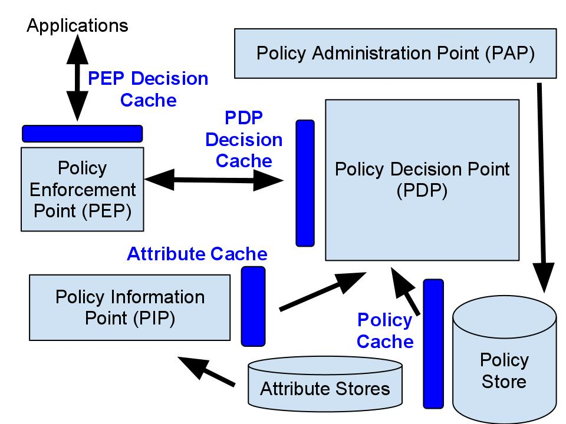

# Improving PDP Performance with Caching

One of the most effective ways to improve XACML PDP performance is caching. WSO2 Identity Server implements caching at multiple layers of the XACML reference architecture, each targeting a different part of the evaluation pipeline.



---

## The four caching layers

### 1. Policy cache

Policies are stored in the database and loaded into memory for evaluation. Without caching, every authorization request would require a database read.

**Design considerations**:
- The policy cache must be invalidated whenever a policy is updated in the PAP.
- In a clustered deployment, the cache must be distributed across all PDP nodes.
- Loading all policies upfront can cause out-of-memory issues if the policy count is large (1000+). On-demand loading is configurable via `reference_max_policy_entries`.

**WSO2 IS implementation**: Policies are stored in the database (JDBC). When any policy change occurs via PAP, all policies are reloaded into the cache. Hazelcast is used for distributed cache invalidation across clustered nodes.

**Configuration**:

```toml
[identity.entitlement.policy_point.pdp]
reference_max_policy_entries = "3000"  # Max policies kept in memory
```

---

### 2. Attribute cache

Attribute values retrieved from external PIP sources (remote LDAP, JDBC, web services) are cached to avoid repeated external calls for the same attribute during policy evaluation.

**Design considerations**:
- Attribute cache entries must be invalidated when external attribute sources are updated (e.g., a user's role changes in LDAP).
- Invalidation messages must be distributed across clustered PDP nodes.

**WSO2 IS implementation**: A shared attribute cache covers all PIP extensions. Individual PIPs can override the default cache by implementing their own cache strategy. Hazelcast distributes cache invalidation messages across cluster nodes.

**Configuration**:

```toml
[identity.entitlement.policy_point.pdp.caching.attribute_caching]
enabled = true
caching_interval = "5m"  # How long attribute values are cached
```

---

### 3. PDP decision cache

For high-traffic systems where the same authorization query hits the PDP repeatedly (same subject, resource, action), caching the PDP decision avoids re-evaluating the full policy set on each request.

**Design considerations**:
- The decision cache must be invalidated when:
  - The policy cache is updated (a policy changed)
  - The attribute cache is invalidated (a user attribute changed)
  - The global policy combining algorithm is updated
- Invalidation must be distributed in a cluster.

**WSO2 IS implementation**: A concurrent hash map is used as the decision cache. The cache is not replicated across nodes — only invalidation messages are distributed via Hazelcast. When one node invalidates its decision cache, all other nodes do the same.

Each cache entry has a configurable TTL (`caching_interval`), which limits unbounded cache growth.

**Configuration**:

```toml
[identity.entitlement.policy_point.pdp.caching.decision_caching]
enabled = true
caching_interval = "5m"
```

---

### 4. PEP decision cache

The PEP (your application) can also cache PDP decisions locally, completely eliminating the network round-trip to IS for repeated identical requests. This typically gives the largest performance gain.

**Design considerations**:
- The PEP cache must be invalidated whenever the PDP decision cache is invalidated.
- Invalidation messages need a reliable delivery mechanism from PDP to PEP.

**WSO2 IS implementation**: IS provides the PDP, PAP, and PIP but not the PEP — the PEP is part of your application. IS supports sending cache invalidation notifications to registered external PEP endpoints when policies or user attributes change. See [Policy Update Notifications](policy-update-notifications.md) for setup instructions.

---

## Resource cache

A fifth configurable cache covers resource-related attribute lookups.

**Configuration**:

```toml
[identity.entitlement.policy_point.pdp.caching.resource_caching]
enabled = true
caching_interval = "5m"
```

---

## Policy cache interval

The policy cache itself has a separate interval that controls how long a loaded policy set stays cached before a full reload:

```toml
[identity.entitlement.policy_point.pdp.caching.policy_caching]
caching_interval = "100s"
```

---

## Full caching configuration reference

The caching configuration blocks from `deployment.toml` (already included in the [setup guide](../../README.md)) in one place for reference:

```toml
[identity.entitlement.policy_point.pdp]
default_caching_interval = "5m"
registry_level_policy_cache_clear = false
reference_max_policy_entries = "3000"

[identity.entitlement.policy_point.pdp.caching.decision_caching]
enabled = true
caching_interval = "$ref{identity.entitlement.policy_point.pdp.default_caching_interval}"

[identity.entitlement.policy_point.pdp.caching.attribute_caching]
enabled = true
caching_interval = "$ref{identity.entitlement.policy_point.pdp.default_caching_interval}"

[identity.entitlement.policy_point.pdp.caching.resource_caching]
enabled = true
caching_interval = "$ref{identity.entitlement.policy_point.pdp.default_caching_interval}"

[identity.entitlement.policy_point.pdp.caching.policy_caching]
caching_interval = "100s"

[identity.entitlement]
entitlement_engine_caching_interval = "1d"
```

`$ref{...}` means the value is inherited from `default_caching_interval`. Adjust `default_caching_interval` to tune all caches at once, or override individual intervals as needed.

---

## Tuning recommendations

| Scenario | Recommendation |
|---|---|
| Low policy change frequency, high request volume | Increase `decision_caching.caching_interval` (e.g., `30m`) |
| Frequent policy updates | Reduce `policy_caching.caching_interval` or set `registry_level_policy_cache_clear = true` |
| External attribute sources update often (LDAP sync) | Reduce `attribute_caching.caching_interval` |
| Large policy set (5000+ policies) | Reduce `reference_max_policy_entries` and rely on on-demand loading |
| Clustered deployment | Ensure Hazelcast clustering is configured — cache invalidation depends on it |
