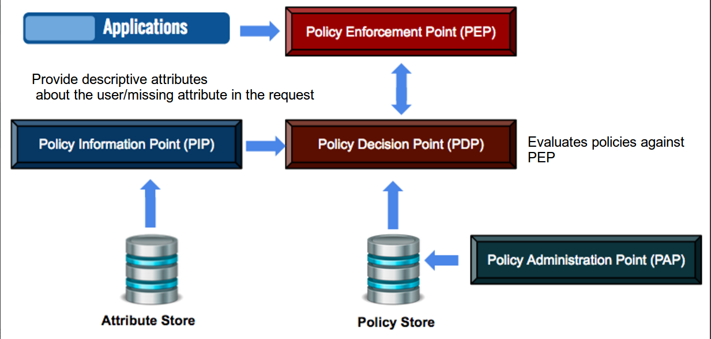
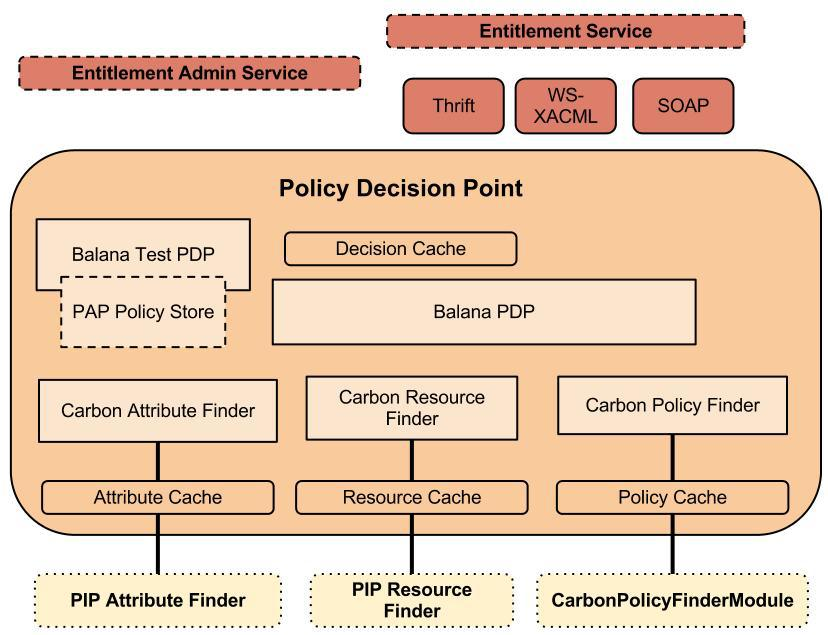
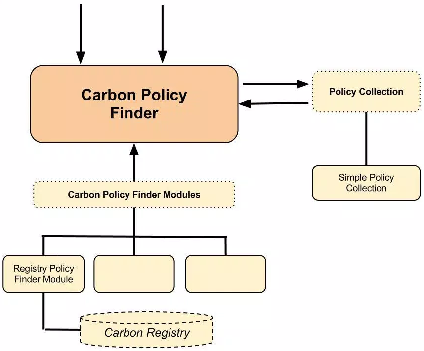

# Identity Server as a XACML Engine

WSO2 Identity Server includes full support for XACML (eXtensible Access Control Markup Language) 2.0 and 3.0, enabling fine-grained, policy-based access control for your applications and APIs.

## What is XACML?

XACML is an OASIS standard that defines both a policy language for expressing access control rules and a request/response protocol for evaluating those rules. It enables **fine-grained authorization** — controlling access based on rich conditions like user attributes, resource types, time of day, or any combination thereof.

XACML is particularly suited for scenarios where simple role-based checks are insufficient, such as:

- Restricting access based on a user's department, location, or clearance level
- Controlling which OAuth scopes a user can be granted
- Filtering outbound provisioning based on user claim values
- Centralizing authorization decisions across multiple applications

## XACML System Architecture



A XACML system consists of four main components:

| Component | Full Name | Role |
|---|---|---|
| **PEP** | Policy Enforcement Point | Intercepts access requests, calls the PDP, and enforces the decision |
| **PDP** | Policy Decision Point | Evaluates XACML policies against the incoming request and returns a decision |
| **PAP** | Policy Administration Point | Where policies are created, stored, managed, and published |
| **PIP** | Policy Information Point | Provides additional attributes needed for policy evaluation (e.g., user roles, claims) |

The request flow is:

1. A user or application attempts to access a resource — the **PEP** intercepts the request.
2. The PEP formulates a XACML request and sends it to the **PDP**.
3. The PDP retrieves the applicable policies from the **PAP**.
4. The PDP fetches any missing attributes from the **PIP** (e.g., the user's roles from LDAP).
5. The PDP evaluates the policies and returns a decision: **Permit**, **Deny**, **NotApplicable**, or **Indeterminate**.
6. The PEP enforces the decision.

## XACML Engine Architecture in WSO2 Identity Server



WSO2 Identity Server acts as the **PDP**, **PAP**, and **PIP** in a XACML deployment:

- **PAP** — The Policy Administration console (accessible via the IS Console or REST API) is where you create, edit, and publish policies.
- **PDP** — The Balana XACML engine embedded in IS evaluates policies at runtime.
- **PIP** — IS automatically resolves user attributes (roles, claims, user-store domain) from the underlying user store. Additional PIPs can be plugged in via extension points.

The **PEP** lives in your application or in IS itself. When XACML-based authorization is enabled on an application, IS acts as both PDP and PEP.

### Carbon Policy Finder



IS uses the **Carbon Policy Finder** to locate and load policies at evaluation time. Policies can be stored in the database (default) or the file system. Multiple policy finders can be configured in parallel.

## How to Use IS as a XACML Engine

Once the XACML connector is installed (see the [setup guide](../../README.md)), the typical workflow is:

1. **Create a policy** — Write a XACML policy in the Policy Administration console. See [Managing XACML Policies](manage-xacml-policies.md).
2. **Test** — Use the TryIt tool to evaluate the policy against sample requests directly in the PAP — before activating, without affecting runtime.
3. **Activate** — Enable the policy for runtime evaluation.
4. **Enable enforcement** — Either enable authorization on an application (IS acts as PEP) or send XACML requests from your own PEP via the REST API.

## PEP-to-PDP communication protocols

By default, PEPs communicate with the PDP via **HTTPS REST**. IS also supports the **Thrift** protocol, which is significantly faster and produces lower response times for high-volume authorization scenarios.

To enable Thrift:

```toml
[entitlement.thrift]
enable = true
```

Once enabled, your PEP can use the Thrift-based `EntitlementServiceClient` to send authorization requests to IS instead of the REST endpoint.

---

For specific use cases, refer to:

**Policy management**
- [Managing XACML Policies](manage-xacml-policies.md) — Create, edit, publish, version, and test policies
- [XACML Policy Templates](xacml-policy-templates.md) — Pre-built templates for common authorization patterns
- [XACML Policy Reference](xacml-policy-reference.md) — XACML 2.0/3.0 structure, combining algorithms, XPath

**Authorization flows**
- [Fine-grained Authorization for Applications](fine-grained-authorization.md) — XACML authorization handler on an app
- [Fine-grained Authorization using JSON Format](fine-grained-auth-json.md) — Send XACML requests and responses as JSON
- [Multiple Decision Profile (MDP)](multiple-decision-profile.md) — Batch multiple authorization questions in one request
- [Validate OAuth Scope with XACML](attribute-based-access-control.md) — Scope-based token issuance
- [Rule-based Provisioning](rule-based-provisioning.md) — Control outbound provisioning with XACML rules

**Operations**
- [Entitlement Management REST API](entitlement-rest-api.md) — Manage policies and evaluate requests via REST
- [PDP Caching](pdp-caching.md) — Improve PDP performance with caching
- [Policy Update Notifications](policy-update-notifications.md) — Notify external PEPs when policies change
