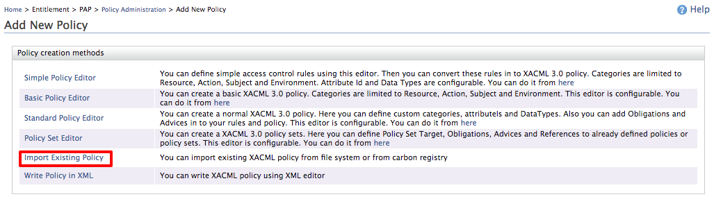
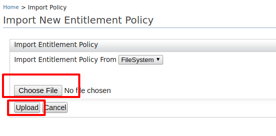

# XACML Policy Reference

This page is a consolidated reference for writing XACML policies. It covers XACML 2.0 and 3.0 policy structure, the key differences between the two versions, combining algorithms, and annotated examples including XPath-based policies.

---

## XACML 2.0 policy structure

A XACML 2.0 policy has an identifier, a rule-combining algorithm, a description, a target, and a set of rules.

```xml
<Policy PolicyId="urn:sample:xacml:2.0:samplepolicy"
  RuleCombiningAlgId="urn:oasis:names:tc:xacml:1.0:rule-combining-algorithm:first-applicable"
  xmlns="urn:oasis:names:tc:xacml:2.0:policy:schema:os">

  <Description>Sample XACML 2.0 Authorization Policy.</Description>

  <Target>
    <Subjects>...</Subjects>
    <Resources>...</Resources>
    <Actions>...</Actions>
  </Target>

  <Rule>...</Rule>

</Policy>
```

### Target (2.0)

The `<Target>` element defines when a policy applies. In 2.0, it uses `<Subjects>`, `<Resources>`, and `<Actions>` child elements:

```xml
<Target>
  <Subjects><AnySubject/></Subjects>
  <Resources>
    <Resource>
      <ResourceMatch MatchId="urn:oasis:names:tc:xacml:1.0:function:string-regexp-match">
        <AttributeValue DataType="http://www.w3.org/2001/XMLSchema#string">
          http://localhost:8280/services/echo/
        </AttributeValue>
        <ResourceAttributeDesignator
          AttributeId="urn:oasis:names:tc:xacml:1.0:resource:resource-id"
          DataType="http://www.w3.org/2001/XMLSchema#string"/>
      </ResourceMatch>
    </Resource>
  </Resources>
  <Actions><AnyAction/></Actions>
</Target>
```

### Rule (2.0)

A rule has a `RuleId`, an `Effect` (Permit or Deny), an optional `Target`, and an optional `Condition`:

```xml
<Rule Effect="Permit" RuleId="primary-access-rule">
  <Target>...</Target>
  <Condition>...</Condition>
</Rule>
```

### Condition (2.0)

A `Condition` is a predicate that must be true for the rule's effect to apply. It uses `Apply` functions to evaluate attribute values:

```xml
<Condition>
  <Apply FunctionId="urn:oasis:names:tc:xacml:1.0:function:string-at-least-one-member-of">
    <SubjectAttributeDesignator
      AttributeId="accessList"
      DataType="http://www.w3.org/2001/XMLSchema#string"/>
    <Apply FunctionId="urn:oasis:names:tc:xacml:1.0:function:string-bag">
      <AttributeValue DataType="http://www.w3.org/2001/XMLSchema#string">nurses</AttributeValue>
      <AttributeValue DataType="http://www.w3.org/2001/XMLSchema#string">doctors</AttributeValue>
    </Apply>
  </Apply>
</Condition>
```

This condition reads: "the subject's `accessList` attribute must contain at least one of `nurses` or `doctors`."

### Rule-combining algorithms (2.0)

```
urn:oasis:names:tc:xacml:1.0:rule-combining-algorithm:deny-overrides
urn:oasis:names:tc:xacml:1.0:rule-combining-algorithm:permit-overrides
urn:oasis:names:tc:xacml:1.0:rule-combining-algorithm:first-applicable
urn:oasis:names:tc:xacml:1.1:rule-combining-algorithm:ordered-deny-overrides
urn:oasis:names:tc:xacml:1.1:rule-combining-algorithm:ordered-permit-overrides
```

---

## XACML 3.0 policy structure

XACML 3.0 uses the same fundamental elements but with a revised namespace and several enhancements.

```xml
<Policy PolicyId="urn:oasis:names:tc:xacml:3.0:example:SimplePolicy"
  RuleCombiningAlgId="urn:oasis:names:tc:xacml:1.0:rule-combining-algorithm:first-applicable"
  xmlns="urn:oasis:names:tc:xacml:3.0:core:schema:wd-17"
  Version="1.0">

  <Description>Sample XACML 3.0 Authorization Policy.</Description>

  <Target>
    <AnyOf>
      <AllOf>
        <Match>
          <AttributeValue/>
          <AttributeDesignator/>
        </Match>
      </AllOf>
    </AnyOf>
  </Target>

  <Rule>...</Rule>

</Policy>
```

### Target (3.0)

In 3.0, the `<Target>` uses `<AnyOf>` / `<AllOf>` / `<Match>` instead of the 2.0 `<Subjects>` / `<Resources>` / `<Actions>` structure. This gives greater flexibility — any attribute category can appear in the target:

```xml
<Target>
  <AnyOf>
    <AllOf>
      <Match MatchId="urn:oasis:names:tc:xacml:1.0:function:string-regexp-match">
        <AttributeValue DataType="http://www.w3.org/2001/XMLSchema#string">
          http://localhost:8280/services/echo/
        </AttributeValue>
        <AttributeDesignator
          MustBePresent="false"
          Category="urn:oasis:names:tc:xacml:3.0:attribute-category:resource"
          AttributeId="urn:oasis:names:tc:xacml:1.0:resource:resource-id"
          DataType="http://www.w3.org/2001/XMLSchema#string"/>
      </Match>
    </AllOf>
  </AnyOf>
</Target>
```

`AnyOf` = logical OR between `AllOf` blocks; `AllOf` = logical AND between `Match` elements.

### Obligations and Advice (3.0)

XACML 3.0 introduces **obligations** (the PEP must fulfill them) and **advice** (the PEP may consider them) at the rule level, not just the policy level:

```xml
<Rule Effect="Deny" RuleId="deny-all">
  <ObligationExpressions>
    <ObligationExpression FulfillOn="Deny" ObligationId="log-denial">
      <AttributeAssignmentExpression AttributeId="message">
        <AttributeValue DataType="http://www.w3.org/2001/XMLSchema#string">
          Access denied — insufficient privileges
        </AttributeValue>
      </AttributeAssignmentExpression>
    </ObligationExpression>
  </ObligationExpressions>
</Rule>
```

### Combining algorithms (3.0)

```
urn:oasis:names:tc:xacml:3.0:rule-combining-algorithm:deny-overrides
urn:oasis:names:tc:xacml:3.0:rule-combining-algorithm:ordered-deny-overrides
urn:oasis:names:tc:xacml:3.0:rule-combining-algorithm:permit-overrides
urn:oasis:names:tc:xacml:3.0:rule-combining-algorithm:ordered-permit-overrides
urn:oasis:names:tc:xacml:3.0:rule-combining-algorithm:deny-unless-permit
urn:oasis:names:tc:xacml:3.0:rule-combining-algorithm:permit-unless-deny
urn:oasis:names:tc:xacml:1.0:rule-combining-algorithm:first-applicable
urn:oasis:names:tc:xacml:1.0:policy-combining-algorithm:only-one-applicable
```

---

## Combining algorithm reference

| Algorithm | Behaviour |
|---|---|
| `deny-overrides` | Any Deny wins. Safest — favours denial. |
| `permit-overrides` | Any Permit wins. Grants access if at least one rule permits. |
| `first-applicable` | First matching rule (Permit or Deny) wins. Stops evaluation early. |
| `deny-unless-permit` | Returns Deny unless at least one Permit is found. Hides NotApplicable/Indeterminate. |
| `permit-unless-deny` | Returns Permit unless at least one Deny is found. Hides NotApplicable/Indeterminate. |
| `only-one-applicable` | PolicySet only — exactly one child must return a valid decision. |
| `ordered-deny-overrides` | Same as `deny-overrides` but guarantees evaluation order. |
| `ordered-permit-overrides` | Same as `permit-overrides` but guarantees evaluation order. |

---

## Key differences: 2.0 vs 3.0

| Feature | XACML 2.0 | XACML 3.0 |
|---|---|---|
| Namespace | `urn:oasis:names:tc:xacml:2.0:policy:schema:os` | `urn:oasis:names:tc:xacml:3.0:core:schema:wd-17` |
| Target structure | `<Subjects>`, `<Resources>`, `<Actions>` | `<AnyOf>` / `<AllOf>` / `<Match>` |
| Obligations/Advice | Policy level only | Rule level and policy level |
| JSON request format | Not supported | Supported (XACML 3.0 JSON profile) |
| Multiple Decision Profile (MDP) | Limited | Full support |
| XPath content matching | Not supported | Supported via `<AttributeSelector>` with `Path` |
| Combining algorithms | Legacy set | Extended set (deny-unless-permit, permit-unless-deny, ordered variants) |

---

## Sample policies

### Role-based access control (2.0)

Permits users in `nurses` or `doctors` groups to access `/patient/` resources:

```xml
<Policy PolicyId="urn:sample:xacml:2.0:healthcare-policy"
  RuleCombiningAlgId="urn:oasis:names:tc:xacml:1.0:rule-combining-algorithm:first-applicable"
  xmlns="urn:oasis:names:tc:xacml:2.0:policy:schema:os">
  <Description>Allow nurses and doctors to access patient records.</Description>
  <Target>
    <Subjects><AnySubject/></Subjects>
    <Resources>
      <Resource>
        <ResourceMatch MatchId="urn:oasis:names:tc:xacml:1.0:function:string-regexp-match">
          <AttributeValue DataType="http://www.w3.org/2001/XMLSchema#string">/patient/</AttributeValue>
          <ResourceAttributeDesignator AttributeId="urn:oasis:names:tc:xacml:1.0:resource:resource-id"
            DataType="http://www.w3.org/2001/XMLSchema#string"/>
        </ResourceMatch>
      </Resource>
    </Resources>
    <Actions><AnyAction/></Actions>
  </Target>
  <Rule Effect="Permit" RuleId="permit-medical-staff">
    <Condition>
      <Apply FunctionId="urn:oasis:names:tc:xacml:1.0:function:string-at-least-one-member-of">
        <SubjectAttributeDesignator AttributeId="accessList"
          DataType="http://www.w3.org/2001/XMLSchema#string"/>
        <Apply FunctionId="urn:oasis:names:tc:xacml:1.0:function:string-bag">
          <AttributeValue DataType="http://www.w3.org/2001/XMLSchema#string">nurses</AttributeValue>
          <AttributeValue DataType="http://www.w3.org/2001/XMLSchema#string">doctors</AttributeValue>
        </Apply>
      </Apply>
    </Condition>
  </Rule>
  <Rule Effect="Deny" RuleId="deny-others"/>
</Policy>
```

### Time-based access control (3.0)

Denies access to `/admin/` resources outside 09:00–17:00:

```xml
<Policy PolicyId="time-based-admin-policy"
  RuleCombiningAlgId="urn:oasis:names:tc:xacml:1.0:rule-combining-algorithm:first-applicable"
  xmlns="urn:oasis:names:tc:xacml:3.0:core:schema:wd-17" Version="1.0">
  <Target>
    <AnyOf><AllOf>
      <Match MatchId="urn:oasis:names:tc:xacml:1.0:function:string-regexp-match">
        <AttributeValue DataType="http://www.w3.org/2001/XMLSchema#string">/admin/.*</AttributeValue>
        <AttributeDesignator Category="urn:oasis:names:tc:xacml:3.0:attribute-category:resource"
          AttributeId="urn:oasis:names:tc:xacml:1.0:resource:resource-id"
          DataType="http://www.w3.org/2001/XMLSchema#string" MustBePresent="false"/>
      </Match>
    </AllOf></AnyOf>
  </Target>
  <Rule Effect="Deny" RuleId="deny-outside-hours">
    <Condition>
      <Apply FunctionId="urn:oasis:names:tc:xacml:1.0:function:not">
        <Apply FunctionId="urn:oasis:names:tc:xacml:2.0:function:time-in-range">
          <Apply FunctionId="urn:oasis:names:tc:xacml:1.0:function:time-one-and-only">
            <AttributeDesignator Category="urn:oasis:names:tc:xacml:3.0:attribute-category:environment"
              AttributeId="urn:oasis:names:tc:xacml:1.0:environment:current-time"
              DataType="http://www.w3.org/2001/XMLSchema#time" MustBePresent="false"/>
          </Apply>
          <AttributeValue DataType="http://www.w3.org/2001/XMLSchema#time">09:00:00+05:30</AttributeValue>
          <AttributeValue DataType="http://www.w3.org/2001/XMLSchema#time">17:00:00+05:30</AttributeValue>
        </Apply>
      </Apply>
    </Condition>
  </Rule>
  <Rule Effect="Permit" RuleId="permit-during-hours"/>
</Policy>
```

---

## Writing XACML 3.0 policies using XPath

XPath matching is a XACML 3.0 feature that lets you evaluate XML content passed in the request body. It is useful when your PEP passes structured XML data (e.g., patient records, transaction data) and the policy needs to inspect field values within that XML.

### How it works

The PEP includes a `<Content>` element in the resource attributes of the XACML request. The policy uses an `<AttributeSelector>` with a `Path` attribute (XPath expression) to extract values from that content.

### Sample scenario

A healthcare application **Medicom** returns patient records from a datastore. The rule: **users can only read their own patient records** — a user `alex` can only read records where `patientId` is `alex`.

### Policy

```xml
<Policy xmlns="urn:oasis:names:tc:xacml:3.0:core:schema:wd-17"
  PolicyId="medi-xpath-test-policy"
  RuleCombiningAlgId="urn:oasis:names:tc:xacml:1.0:rule-combining-algorithm:first-applicable"
  Version="1.0">
  <Description>
    Users can only read their own patient records.
    XPath evaluation checks the patientId in the XML content against the subject id.
  </Description>
  <PolicyDefaults>
    <XPathVersion>http://www.w3.org/TR/1999/REC-xpath-19991116</XPathVersion>
  </PolicyDefaults>
  <Target>
    <AnyOf><AllOf>
      <Match MatchId="urn:oasis:names:tc:xacml:1.0:function:string-regexp-match">
        <AttributeValue DataType="http://www.w3.org/2001/XMLSchema#string">read</AttributeValue>
        <AttributeDesignator MustBePresent="false"
          Category="urn:oasis:names:tc:xacml:3.0:attribute-category:action"
          AttributeId="urn:oasis:names:tc:xacml:1.0:action:action-id"
          DataType="http://www.w3.org/2001/XMLSchema#string"/>
      </Match>
    </AllOf></AnyOf>
  </Target>
  <Rule RuleId="rule1" Effect="Permit">
    <Description>Permit if the subject id matches the patientId in the XML content.</Description>
    <Condition>
      <Apply FunctionId="urn:oasis:names:tc:xacml:1.0:function:any-of">
        <Function FunctionId="urn:oasis:names:tc:xacml:1.0:function:string-equal"/>
        <Apply FunctionId="urn:oasis:names:tc:xacml:1.0:function:string-one-and-only">
          <AttributeDesignator
            Category="urn:oasis:names:tc:xacml:1.0:subject-category:access-subject"
            AttributeId="urn:oasis:names:tc:xacml:1.0:subject:subject-id"
            DataType="http://www.w3.org/2001/XMLSchema#string" MustBePresent="false"/>
        </Apply>
        <!-- XPath into the Content element; namespace ak is declared in the request -->
        <AttributeSelector MustBePresent="false"
          Category="urn:oasis:names:tc:xacml:3.0:attribute-category:resource"
          Path="//ak:record/ak:patient/ak:patientId/text()"
          DataType="http://www.w3.org/2001/XMLSchema#string"/>
      </Apply>
    </Condition>
  </Rule>
  <Rule RuleId="rule2" Effect="Deny">
    <Description>Deny all other requests.</Description>
  </Rule>
</Policy>
```

### Sample request

The PEP passes the patient record as `<Content>` inside the resource attributes. The custom namespace `ak` is declared inline:

```xml
<Request xmlns="urn:oasis:names:tc:xacml:3.0:core:schema:wd-17"
  ReturnPolicyIdList="false" CombinedDecision="false">
  <Attributes Category="urn:oasis:names:tc:xacml:1.0:subject-category:access-subject">
    <Attribute IncludeInResult="false" AttributeId="urn:oasis:names:tc:xacml:1.0:subject:subject-id">
      <AttributeValue DataType="http://www.w3.org/2001/XMLSchema#string">alex</AttributeValue>
    </Attribute>
  </Attributes>
  <Attributes Category="urn:oasis:names:tc:xacml:3.0:attribute-category:resource">
    <Content>
      <ak:record xmlns:ak="http://akpower.org">
        <ak:patient>
          <ak:patientId>alex</ak:patientId>
          <ak:patientName><ak:first>Alex</ak:first><ak:last>Allan</ak:last></ak:patientName>
        </ak:patient>
      </ak:record>
    </Content>
  </Attributes>
  <Attributes Category="urn:oasis:names:tc:xacml:3.0:attribute-category:action">
    <Attribute IncludeInResult="false" AttributeId="urn:oasis:names:tc:xacml:1.0:action:action-id">
      <AttributeValue DataType="http://www.w3.org/2001/XMLSchema#string">read</AttributeValue>
    </Attribute>
  </Attributes>
</Request>
```

**Response** — `Permit` because `alex` (subject) matches `alex` (patientId in content):

```xml
<Response>
  <Result>
    <Decision>Permit</Decision>
    <Status><StatusCode Value="urn:oasis:names:tc:xacml:1.0:status:ok"/></Status>
  </Result>
</Response>
```

### Deploy and test

1. In **Policy Administration**, click **New Policy > Import Existing Policy**.

   

2. Upload the policy XML file.

   

3. Publish to PDP.

   

4. Use the **TryIt** tool — paste the sample request XML and click **Evaluate With PDP**.
